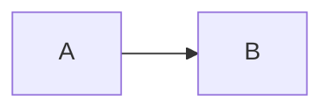



## 站点结构

* 站点配置：`_config.yml`
* 顶部导航栏配置：`_data/navigation.yml`
* 单页内容：`_pages/`
* 各类内容集合（每个条目一个文件）：
  * `_publications/` 论文
  * `_talks/` 报告
  * `_teaching/` 教学
  * `_portfolio/` 作品集
  * `_posts/` 博客文章
* 页脚：`_includes/footer.html`
* 静态文件（PDF 等）：`files/`
* 头像（在 `_config.yml` 中设置）：`images/profile.png`

## Markdown 与扩展语法

* 文件名为 `.md` 时按 Markdown 渲染，为 `.html` 时按 HTML 渲染。
* 本站使用 Jekyll 的 kramdown 解析器（GFM），语法与 GitHub 上的 Markdown 基本一致，并支持 jemoji 表情符号。
* 数学公式用 MathJax（脚注了 `mathjax@4` 脚本，直接写公式即可，不需要代码块语言名）：
  * 独立公式：`$$ ... $$`
  * 行内公式：`\( ... \)`（在 YAML 字段如 citation 中只能用这种写法）

$$
\nabla \cdot E = \frac{\rho}{\epsilon_0}, \qquad a^2 + b^2 = c^2
$$

行内公式示例：\(a^2 + b^2 = c^2\)。

* 流程图用 Mermaid：



* 交互式图表用 Plotly（代码块内容必须是合法 JSON，所有键都要加引号）：

```plotly
{
  "data": [
    { "x": [1, 2, 3, 4], "y": [10, 15, 13, 17], "type": "scatter" }
  ]
}
```

* 提示框（notice）：

```markdown
**注意！** 在段落下面单独写一行 `{: .notice}` 即可生成提示框。
{: .notice}
```

**注意！** 在段落下面单独写一行 `{: .notice}` 即可生成提示框。
{: .notice}

## 常见排版示例

### 标题

#### 四级标题

##### 五级标题

###### 六级标题

### 引用

> 引用一段话。

### 表格

| 条目       | 年份 | 说明           |
| --------   | ---- | -------------- |
| 示例一     | 2016 | 列表项说明文字 |
| 示例二     | 2019 | 列表项说明文字 |

### 列表

* 第一项
  * 子项
* 第二项

1. 第一项
2. 第二项

### 折叠区域

<details>
  <summary>默认折叠</summary>
  这段内容默认是折叠起来的。
</details>

### 脚注

正文里写 `[^1]` 即可插入脚注。[^1]

[^1]: 这里是脚注内容。

## 更多资料

* [kramdown 语法](https://kramdown.gettalong.org/syntax.html)
* [Liquid 语法](https://shopify.github.io/liquid/tags/control-flow/)
* [Minimal Mistakes 主题文档](https://mmistakes.github.io/minimal-mistakes/docs/configuration/)（本站主题的上游）
